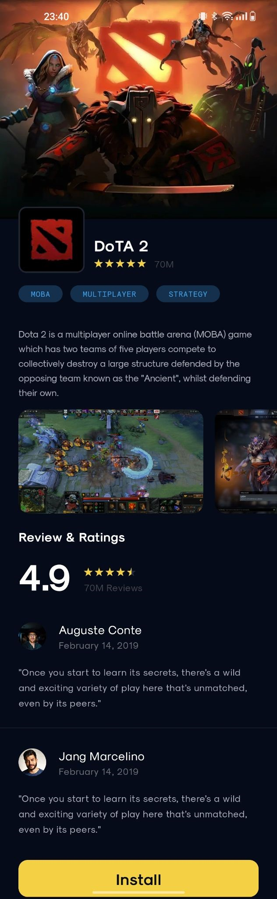
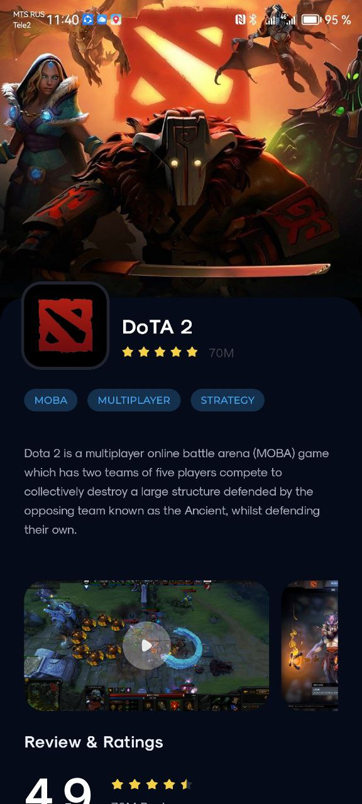
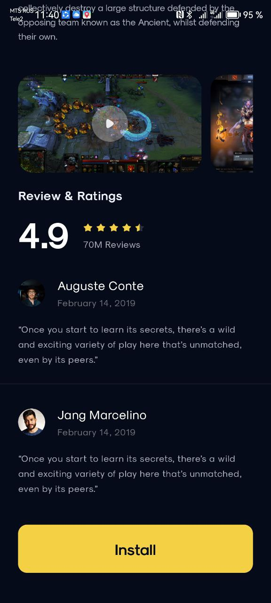

# Описание проекта

   

Данная работа была выполнена в рамках прохождения курса «Профессиональная разработка мобильных приложений» от компании Effective с целью получения первичных навыков в работе с инструментарием пользовательского интерфейса для Android разработки __Jetpack Compose__.

Средствами представленной технологии необходимо было реализовать следующий экран:



&NewLine;
в результате работы с помощью инструментов __Jetpack Compose__ было получено приложение с одним экраном, который имеет вид:
&NewLine;

 

Также был сгенерирован APK файл: [ ](AndroidDotaChallenge.apk)

```Минимальная версия Android для установки: 7.0 (24 API Level)```

```Приложение поддерживается версией Android 14.0 (34 API Level)```
